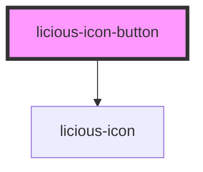

# licious-icon-button

<!-- Auto Generated Below -->

## Properties

| Property   | Attribute  | Description | Type                                                                                   | Default     |
| ---------- | ---------- | ----------- | -------------------------------------------------------------------------------------- | ----------- |
| `disabled` | `disabled` |             | `boolean`                                                                              | `undefined` |
| `icon`     | `icon`     |             | `"close" \| "edit" \| "logout" \| "menu" \| "paint" \| "rubbish" \| "save" \| "trash"` | `undefined` |

## Shadow Parts

| Part       | Description |
| ---------- | ----------- |
| `"button"` |             |
| `"icon"`   |             |

## Dependencies

### Depends on

- [licious-icon](../licious-icon)

### Graph

----------------------------------------------

*Built with [StencilJS](https://stenciljs.com/)*
