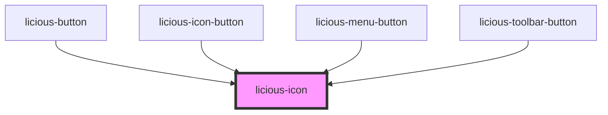

# licious-icon

<!-- Auto Generated Below -->

## Properties

| Property | Attribute | Description | Type                                                                                   | Default     |
| -------- | --------- | ----------- | -------------------------------------------------------------------------------------- | ----------- |
| `icon`   | `icon`    |             | `"close" \| "edit" \| "logout" \| "menu" \| "paint" \| "rubbish" \| "save" \| "trash"` | `undefined` |

## Shadow Parts

| Part               | Description |
| ------------------ | ----------- |
| `"icon"`           |             |
| `"icon-container"` |             |

## Dependencies

### Used by

 - [licious-button](../licious-button)
 - [licious-icon-button](../licious-icon-button)
 - [licious-menu-button](../licious-menu-button)
 - [licious-toolbar-button](../licious-toolbar-button)

### Graph

----------------------------------------------

*Built with [StencilJS](https://stenciljs.com/)*
