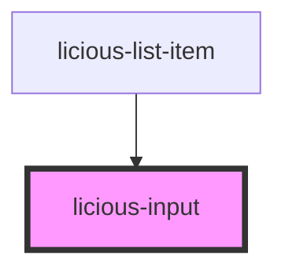

# licious-input

<!-- Auto Generated Below -->

## Properties

| Property      | Attribute     | Description | Type      | Default     |
| ------------- | ------------- | ----------- | --------- | ----------- |
| `disabled`    | `disabled`    |             | `boolean` | `undefined` |
| `placeholder` | `placeholder` |             | `string`  | `undefined` |
| `value`       | `value`       |             | `string`  | `''`        |

## Dependencies

### Used by

 - [licious-list-item](../licious-list-item)

### Graph

----------------------------------------------

*Built with [StencilJS](https://stenciljs.com/)*
