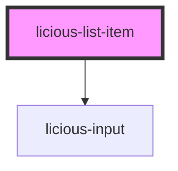

# licious-list-item

<!-- Auto Generated Below -->

## Properties

| Property      | Attribute     | Description | Type                  | Default     |
| ------------- | ------------- | ----------- | --------------------- | ----------- |
| `header`      | `header`      |             | `string`              | `''`        |
| `mode`        | `mode`        |             | `"display" \| "edit"` | `'display'` |
| `placeholder` | `placeholder` |             | `string`              | `undefined` |
| `subheader`   | `subheader`   |             | `string`              | `''`        |
| `value`       | `value`       |             | `string`              | `''`        |

## Events

| Event          | Description | Type                  |
| -------------- | ----------- | --------------------- |
| `inputChanged` |             | `CustomEvent<string>` |

## Dependencies

### Depends on

- [licious-input](../licious-input)

### Graph

----------------------------------------------

*Built with [StencilJS](https://stenciljs.com/)*
