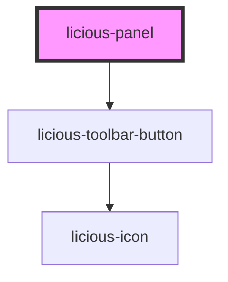

# licious-panel

<!-- Auto Generated Below -->

## Properties

| Property | Attribute | Description | Type                   | Default    |
| -------- | --------- | ----------- | ---------------------- | ---------- |
| `header` | `header`  |             | `string`               | `"Header"` |
| `open`   | `open`    |             | `boolean`              | `false`    |
| `size`   | `size`    |             | `"lg" \| "md" \| "sm"` | `"lg"`     |

## Events

| Event         | Description | Type                   |
| ------------- | ----------- | ---------------------- |
| `panelClosed` |             | `CustomEvent<boolean>` |

## Shadow Parts

| Part            | Description |
| --------------- | ----------- |
| `"panel-title"` |             |

## Dependencies

### Depends on

- [licious-toolbar-button](../licious-toolbar-button)

### Graph

----------------------------------------------

*Built with [StencilJS](https://stenciljs.com/)*
