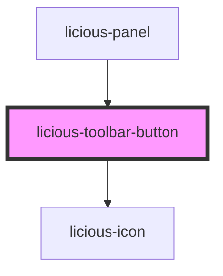

# licious-toolbar-button

<!-- Auto Generated Below -->

## Properties

| Property   | Attribute  | Description | Type                                                                         | Default     |
| ---------- | ---------- | ----------- | ---------------------------------------------------------------------------- | ----------- |
| `disabled` | `disabled` |             | `boolean`                                                                    | `undefined` |
| `icon`     | `icon`     |             | `"close" \| "edit" \| "logout" \| "paint" \| "rubbish" \| "save" \| "trash"` | `undefined` |
| `size`     | `size`     |             | `"lg" \| "sm" \| "xs"`                                                       | `undefined` |

## Dependencies

### Used by

 - [licious-panel](../licious-panel)

### Depends on

- [licious-icon](../licious-icon)

### Graph

----------------------------------------------

*Built with [StencilJS](https://stenciljs.com/)*
